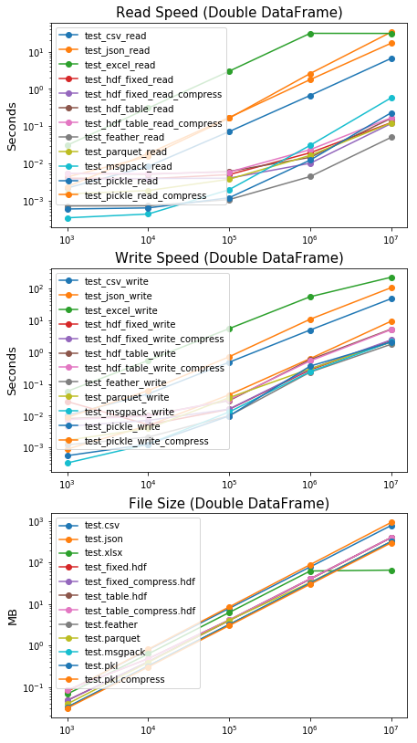

Python Performance Benchmark
============================

This repository is Python benchmark for common usage in data science.

Environment: OS Ubuntu 18.04, CPU Intel i5-8400, Anaconda Python 3.6.5

Pandas I/O
----------

Blog post: 
[Chinese](https://medium.com/@black_swan/pandas-i-o-%E6%95%88%E7%8E%87%E6%B8%AC%E8%A9%A6-c9e20152658a) 
[English](https://medium.com/@black_swan/pandas-i-o-benchmarking-56cd688f832b)

Data: n row x 4 columns random double dataframe.

Remark:
- time or size (Y axis) in log scale.
- Maximum row for excel output is 1048575 rows, so file size and read 
speed of 10^7 are under estimated.

MKL with Numpy
--------

Installation please refer to my blog post:
[Chinese](https://medium.com/@black_swan/ubuntu-%E4%BD%BF%E7%94%A8-intel-mkl-%E5%8A%A0%E9%80%9F-numpy-71ef7587af47) 
[English](https://medium.com/@black_swan/using-mkl-to-boost-numpy-performance-on-ubuntu-f62781e63c38)

Result (run time in seconds):

|                       |OpenBLAS|  MKL  |
|-----------------------|--------|-------|
|Vector Multiply        | 4.637  | 5.022 |
|Matrix Multiply        | 4.629  | 5.224 |
|Eigen decomposition    | 4.695  | 3.449 |

Remark: vector size 8192, matrix size for multiply 8192x8192, 
matrix size for decomposition 2048x2048 
